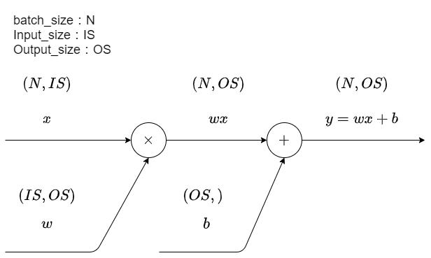
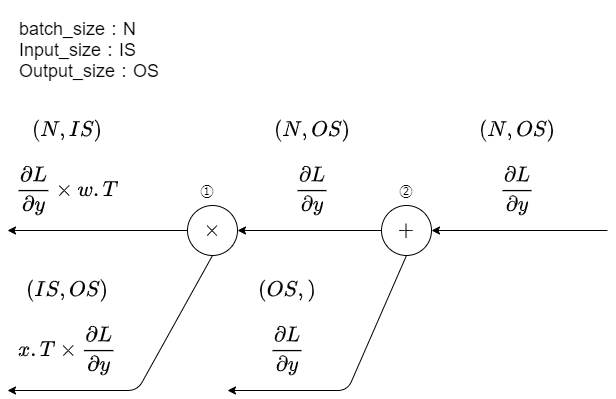
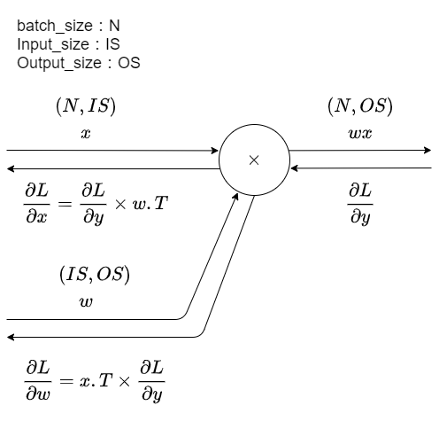

## Affine layerとは
Affine layerは前の層から受け取ったデータに重みをかけ、バイアスを足して次の層に流すというlayer。  
tensorflowだと、Dense層、pytorchだとLinear層に当たる。  
<br />

## 式の確認
  
式で書くとこんな感じ。  
は前の層から受け取ったデータ、が重み、がバイアスで学習すべきパラメータにあたり、は出力するデータ。  
<br />

## 順伝播の計算グラフ  
  
<br />
```python
def forward(self, x):
    self.x = x
    y = cp.dot(x, self.weight) + self.bias$$

    return y
```

## 逆伝播の計算グラフ  
  
<br />
```python
def backward(self, dout):
    dx = np.dot(dout, self.weight.T) # 次の層に逆伝播する値
    self.dw = np.dot(self.x.T, dout) # 重みの勾配情報
    self.db = np.sum(dout, axis = 0) # バイアスの勾配情報
    
    return dx
```

### ノード2の逆伝播  
  
<br />
＋ノードなので基本的にはそのまま流すだけだが、バイアスがブロードキャストされているという点だけ注意。  
ここ忘れていると、パラメータ更新の時に計算が狂う。

### ノード1の逆伝播
  
<br />
ノードなので、相手の値を掛け算するだけだが、行列計算なので入れ替えが必要。  
とのところ