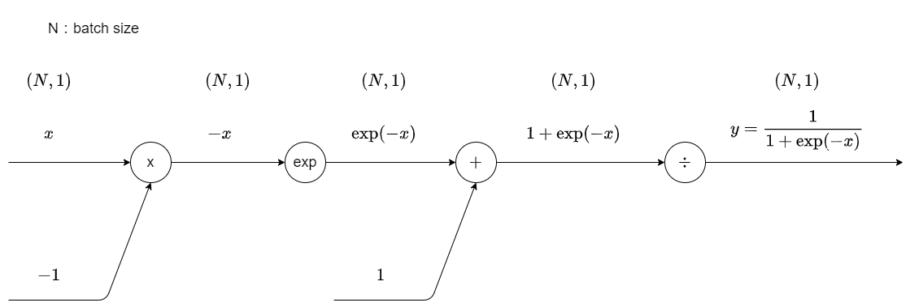
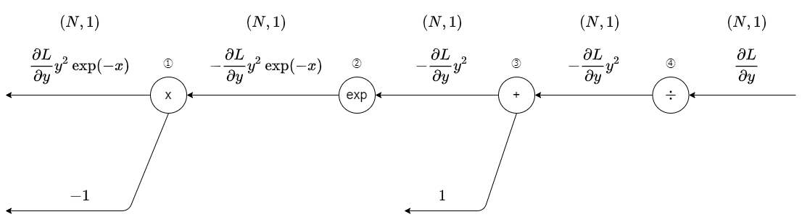
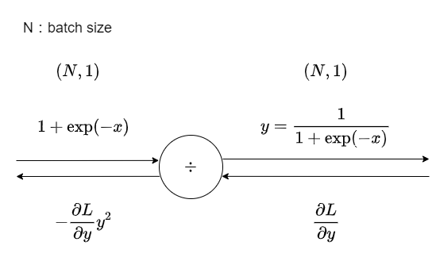
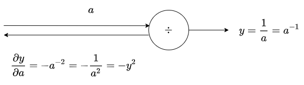
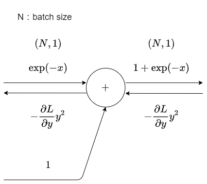
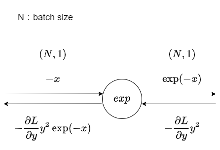
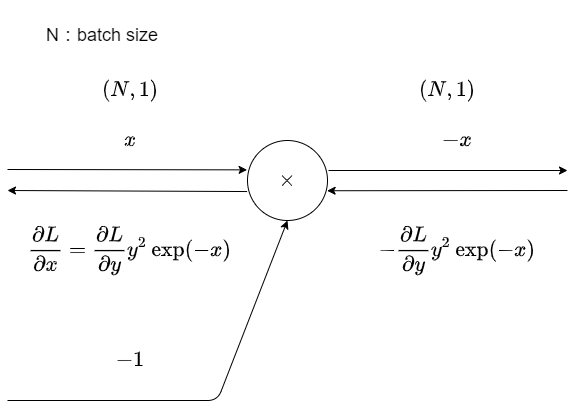

## sigmoidとは
活性化関数の１種。  
２値分類のタスクの時に、出力層の活性化関数として使われる。  

## 式の確認
&space;=&space;\frac{1}{1&plus;\exp(-x)})

## 順伝播の計算グラフ

<br />
```python
def forward(self, x):
    out = 1 / (1 + np.exp(-x))
    
    return out
```

## 逆伝播の計算グラフ

<br />
```python
def backward(self, dout):
    dx = dout * (1.0 - self.out) * self.out
    
    return dx
```

## ノード4の逆伝播
  
<br />
ノードの計算グラフ  
<br />
  
<br />
ノードは入力値の逆数を出力とするノード。  
逆伝播は計算すれば出力を２乗してーをつければOK。

## ノード3の逆伝播


## ノード2の逆伝播
  
<br />
ノードの計算グラフ  
<br />


## ノード1の逆伝播


## 式の変換
)  

ここで  

})  

より  

}&space;\left\\{&space;\frac{1&space;&plus;&space;exp(-x)}{1&space;&plus;&space;exp(-x)}&space;-&space;\frac{1}{1&space;&plus;&space;exp(-x)}&space;\right\\})  

と表せる。 

これを変形させると  

&space;-&space;1}{1&space;&plus;&space;exp(-x)}&space;\cdot&space;\frac{1}{1&space;&plus;&space;exp(-x)})  

となるので  

})  

を抜き出すと  

}&space;\left\\{&space;\frac{1&space;&plus;&space;exp(-x)}{1&space;&plus;&space;exp(-x)}&space;-&space;\frac{1}{1&space;&plus;&space;exp(-x)}&space;\right\\})  

になる。  

ここで  

}&space;=&space;y)  

なので  

)  

となる。  

## おまけ（sigmoid関数の微分）  
&space;=&space;\frac{1}{1&space;&plus;&space;\exp(-x)})

&space;=&space;u^{-1},&space;u&space;=&space;1&space;&plus;&space;\exp(v),&space;v&space;=&space;-x)  

とおくと  

&space;}{&space;\mathrm{d}x&space;}&space;=&space;\frac{&space;\mathrm{d}f(x)&space;}{&space;\mathrm{d}u&space;}&space;\cdot&space;\frac{&space;\mathrm{d}u&space;}{&space;\mathrm{d}v&space;}&space;\cdot&space;\frac{&space;\mathrm{d}v&space;}{&space;\mathrm{d}x&space;})  

と表せるので  

&space;}{&space;\mathrm{d}u&space;}&space;=&space;-u^{-2})

)  

  

より  

&space;}{&space;\mathrm{d}x&space;}&space;=&space;u^{-2}&space;\exp(v))

ここで、元の値を代入すると  

&space;}{\mathrm{d}x}&space;=&space;\left&space;\\{&space;\frac{1}{1&space;&plus;&space;exp(-x)}&space;\right&space;\\}^2&space;\cdot&space;exp(-x))  

となり、逆伝播時に求めた値と一致する。